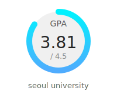

# 🎓 GPA Badge Generator



GPA Badge Generator는 엑셀 파일(`grades.xlsx`)을 기반으로 GPA(학점)를 계산하고, 이를 시각적으로 표현한 SVG 배지를 자동으로 생성하여 `README.md`에 반영하는 GitHub Actions 기반 자동화 시스템입니다.

---

## 📦 기능 소개

- 🎯 **GPA 자동 계산**  
  `assets/grades.xlsx`에 입력된 성적 정보를 바탕으로 GPA를 계산합니다.

- 🖼️ **SVG 형태의 GPA 배지 생성**  
  시각적으로 깔끔한 원형 그래프 형태의 GPA 배지를 만들어 저장소에서 바로 확인할 수 있습니다.

- 🤖 **GitHub Actions 자동 실행**  
  - 매주 월요일 자정(UTC 기준)
  - 수동 실행 (`workflow_dispatch`)
  - 성적 엑셀 파일 변경 시 자동 실행 (`assets/grades.xlsx` 변경 감지)

- 📌 **README 자동 업데이트**  
  `README.md` 파일에 GPA 배지를 자동으로 삽입하거나 갱신합니다.

---

## 📁 프로젝트 구조

```
📦 your-repo/
├── .github/workflows/
│   └── generate_gpa_badge.yml     # GitHub Actions 워크플로우
├── assets/
│   └── grades.xlsx                # GPA 계산에 사용될 엑셀 파일
├── generate_gpa.py                # GPA 계산 및 배지 생성 스크립트
├── gpa_badge.svg                  # 생성된 GPA 배지 (자동 생성됨)
├── requirements.txt               # 파이썬 의존성 명세
└── README.md                      # 본 문서, 배지가 자동 삽입됨
```

---

## 📊 엑셀 파일 형식 (`assets/grades.xlsx`)

| I열 (학점) | K열 (성적) |
|------------|------------|
| 3          | A+         |
| 3          | B0         |
| 2          | C+         |
| 1          | P          |

- 성적은 `A+`, `A0`, `B+`, ... `F`, `P`, `NP` 형식을 따릅니다.
- `P`, `NP`는 GPA 계산에서 제외됩니다.
- 데이터는 **5행부터** 읽어들이며, 상단은 제목 행으로 비워도 무방합니다.

- 해당 데이터는 `세종대학교 기이수성적조회-*.xlsx` 형식을 따릅니다.

---

## ⚙️ 사용 방법

1. `assets/grades.xlsx` 파일을 자신의 성적표에 맞게 업데이트합니다.
2. 변경 내용을 `commit`하고 `push`합니다.
3. GitHub Actions가 자동으로 GPA를 계산하고 `gpa_badge.svg` 및 `README.md`를 갱신합니다.
4. `README.md`에서 자동 생성된 GPA 배지를 확인합니다.

---

## 🧪 로컬 테스트 (선택 사항)

```bash
pip install -r requirements.txt
python generate_gpa.py
```

## 🛠️ 기술 스택
- Python 3.10+
- openpyxl
- GitHub Actions
- SVG (Vector Badge 생성)

## 📝 라이선스

MIT License
자유롭게 사용 및 수정이 가능합니다.

## 🙋‍♀️ 기여

Pull Request와 Issue는 언제든 환영합니다!
더 다양한 스타일의 배지, GPA 4.3/4.0/5.0 변환 등 기여해 주세요 😊
